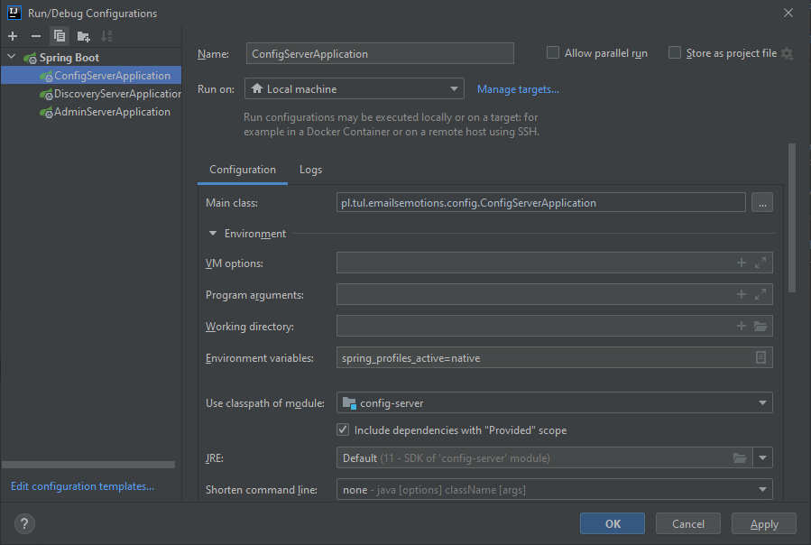
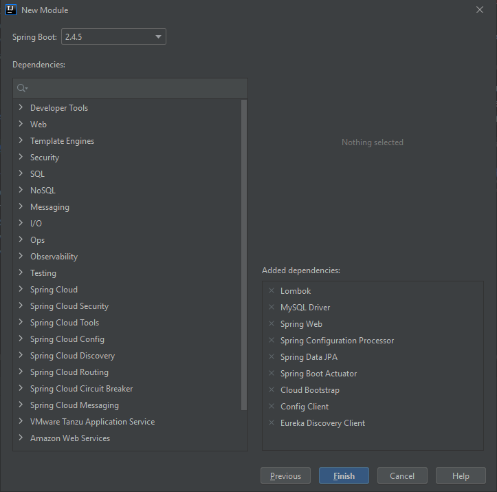

# EmailsEmotions microservice backend

# Important informations
## Config Server Setup
To properly use this backend you must have proper configuration files.

It can be obtained in two ways.
1. Through git
2. Through some friends ;)

The git url for repo is: `https://github.com/EmailsEmotions/EmailsEmotionsConfiguration`

You have to make adjustments in `config-server/src/main/resources/bootstrap.yml`

Change: `native.searchLocations` for path to local git repo or try to setup github configuration.
```spring:
  cloud:
    config:
      server:
        git:
          uri: https://github.com/EmailsEmotions/EmailsEmotionsConfiguration.git
        # Use the File System Backend to avoid git pulling. Enable "native" profile in the Config Server.
        native:
          searchLocations: file:///D:\Development\Mikrousługi\EmailsEmotionsConfiguration
```

Moreover you have to make change how IDE launches config-server. 
The change is to add enviromental variable for `native` profile. The variable is `spring_profiles_active=native`



## Starting locally
Every microservice is a Spring Boot application and can be started locally using IDE (Lombok plugin has to be set up) or `../mvnw spring-boot:run` command. 
Please note that supporting services (Config and Discovery Server) must be started before any other application 
* Discovery Server - http://localhost:8761
* Config Server - http://localhost:8888
* API Gateway - http://localhost:8080

# Creating microservice
You have to choose at least these dependencies when creating new module.

* Spring Web - for constructing spring APIs
* Lombok - for bolierplate code
* Spring Configuration Processor
* Spring Boot Actuator - Custom metrics
* Config Client - Access to config server
* Eureka Discovery Client - Eureka Cilent

Then remember to add to `pom` that dependency. It allows to read `bootstrap.yml`. Which is neccessary in our configuration.
```xml
<dependency>
    <groupId>org.springframework.cloud</groupId>
    <artifactId>spring-cloud-starter-bootstrap</artifactId>
</dependency>
```
Next add `bootstrap.yml` with these configuration properties.
```yaml
spring:
  cloud:
    config:
      uri: http://localhost:8888
  application:
    name: user-service
---
spring:
  config:
    activate:
      on-profile: docker
  cloud:
    config:
      uri: http://config-server:8888
```
You have to give url for `spring.cloud.config.uri` that corresponds to config server


