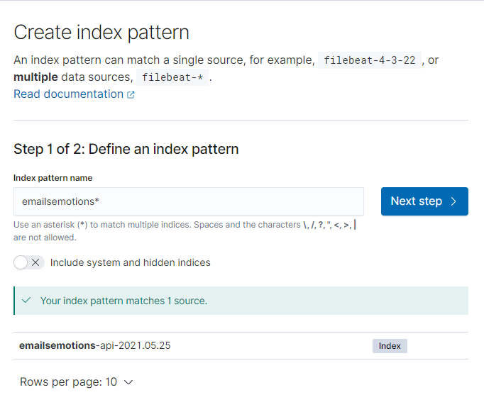
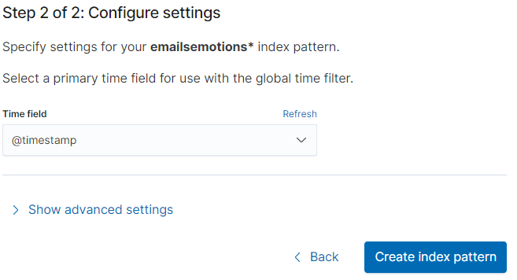
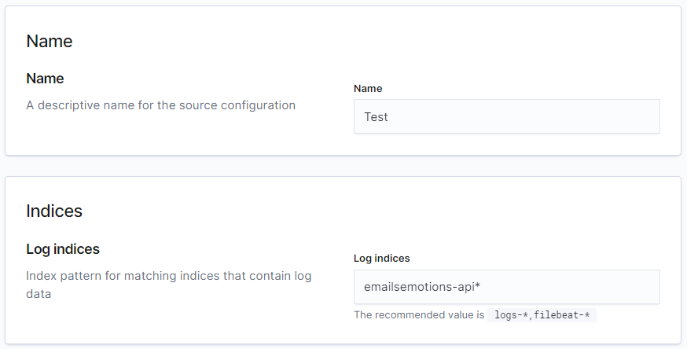
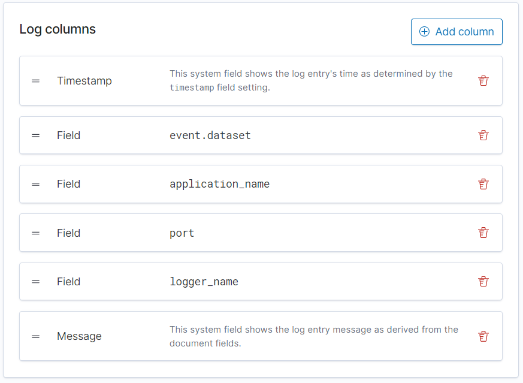
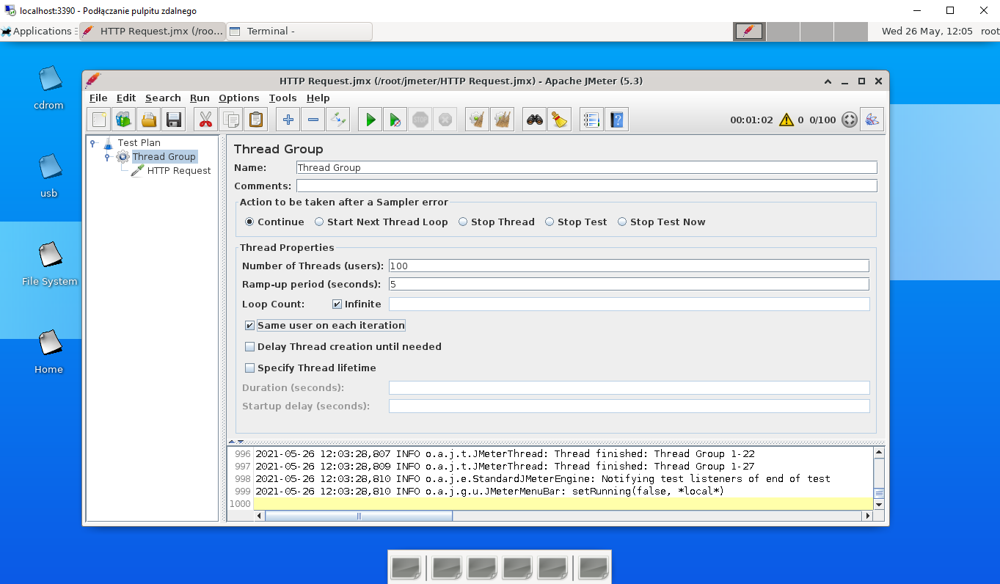
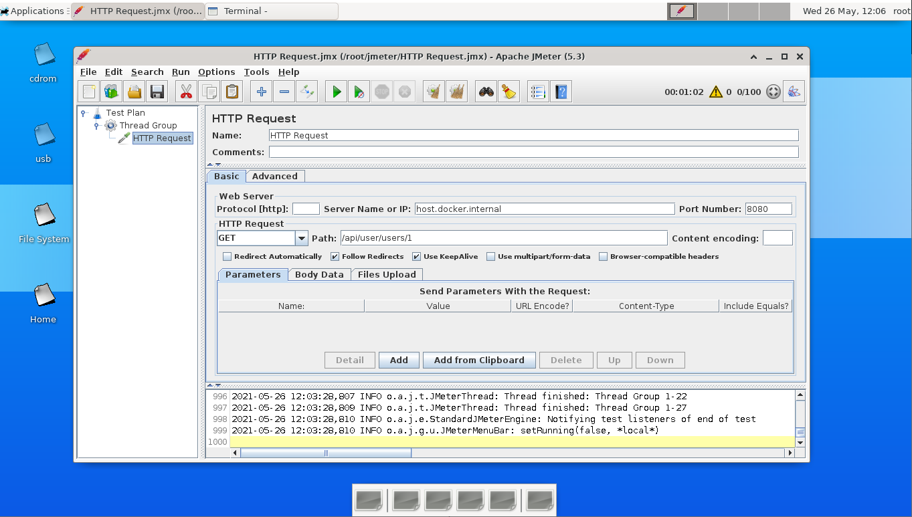

# EmailsEmotions microservice backend

# Important informations
## Git Flow Setup
```shell
git flow init [Enter]x5
```
More informations here https://www.atlassian.com/git/tutorials/comparing-workflows/gitflow-workflow
## Config Server Setup
To properly use this backend you must have proper configuration files.

It can be obtained in two ways.
1. Through git
2. Through some friends ;)

The git url for repo is: `https://github.com/EmailsEmotions/EmailsEmotionsConfiguration`

You have to make adjustments in `config-server/src/main/resources/bootstrap.yml`

Change: `native.searchLocations` for path to local git repo or try to setup github configuration.
```spring:
  cloud:
    config:
      server:
        git:
          uri: https://github.com/EmailsEmotions/EmailsEmotionsConfiguration.git
        # Use the File System Backend to avoid git pulling. Enable "native" profile in the Config Server.
        native:
          searchLocations: file:///D:\Development\Mikrousługi\EmailsEmotionsConfiguration
```

Moreover you have to make change how IDE launches config-server. 
The change is to add enviromental variable for `native` profile. The variable is `spring_profiles_active=native`


## Starting locally
Every microservice is a Spring Boot application and can be started locally using IDE (Lombok plugin has to be set up) or `../mvnw spring-boot:run` command. 
Please note that supporting services (Config and Discovery Server) must be started before any other application 
* Discovery Server - http://localhost:8761
* Config Server - http://localhost:8888
* API Gateway - http://localhost:8080

# Creating microservice
You have to choose at least these dependencies when creating new module.

* Spring Web - for constructing spring APIs
* Lombok - for bolierplate code
* Spring Configuration Processor
* Spring Boot Actuator - Custom metrics
* Config Client - Access to config server
* Eureka Discovery Client - Eureka Cilent

Then remember to add to `pom` that dependency. It allows to read `bootstrap.yml`. Which is neccessary in our configuration.
```xml
<dependency>
    <groupId>org.springframework.cloud</groupId>
    <artifactId>spring-cloud-starter-bootstrap</artifactId>
</dependency>
```
Next add `bootstrap.yml` with these configuration properties.
```yaml
spring:
  cloud:
    config:
      uri: http://localhost:8888
  application:
    name: user-service
---
spring:
  config:
    activate:
      on-profile: docker
  cloud:
    config:
      uri: http://config-server:8888
```
You have to give url for `spring.cloud.config.uri` that corresponds to config server

# Spring Admin
https://codecentric.github.io/spring-boot-admin/2.3.1/#_what_is_spring_boot_admin

## Configuration
https://docs.spring.io/spring-boot/docs/1.5.22.RELEASE/reference/html/boot-features-external-config.html
https://stackoverflow.com/questions/49274032/spring-boot-configuration-how-to-return-always-same-random-value-when-reference

# Spring Eureka Discovery
https://cloud.spring.io/spring-cloud-netflix/multi/multi__service_discovery_eureka_clients.html
## Microservices instances
### baeldung
https://www.baeldung.com/eureka-self-preservation-renewal
### Stack
https://stackoverflow.com/questions/52297664/spring-cloud-eureka-server-self-preservation-and-renew-threshold
https://stackoverflow.com/questions/54468805/eureka-client-instances-are-not-unregister-from-eureka-server-properly
https://stackoverflow.com/questions/33921557/understanding-spring-cloud-eureka-server-self-preservation-and-renew-threshold
https://stackoverflow.com/questions/32616329/eureka-never-unregisters-a-service
## Feign Clients
https://www.baeldung.com/spring-cloud-netflix-eureka

# Spring Cloud Config Client
https://cloud.spring.io/spring-cloud-config/multi/multi__spring_cloud_config_client.html

# ELK stack
The ELK stack could run by configuring ELK on your machine or running `elk-docker-compose.yaml`
```shell
$ docker-compose -f elk-docker-compose.yaml up
```
## Elasticsearch
Elasticsearch configuration is in `elk-docker-compose.yaml` file.
Elastic for now uses docker volumes instead of proper folder (subject to discuss)

## Kibana
Kibana is set on default 5601 port.
To get Kibana working with app you have to setup [Index patterns](https://www.elastic.co/guide/en/kibana/7.12/index-patterns.html)
.
## Index patterns
An index pattern can point to a specific index, for example, your log data from yesterday, or all indices that contain your log data.

Go to `/app/management/kibana/indexPatterns` and click `Create index pattern`.

Then define an index pattern for eg. `emailsemotions-api*`


Tap `Next step >`. As time field select `@timestamp`. And `Create index pattern`



Now you can check if all fields are correct (most of times they are)
## Logs
To show logs from app in Kibana go to `/app/logs/` and Settings `/app/logs/settings`

You have to setup name for source configuration and most important the Log indices.
Log indices is value that you choose for indexPattern so in our example it will be `emailsemotions*`


Next you can add some more Log columns eg. `application_name` or `logger_name`


After that you can see your logs in Stream tab `/app/logs/stream`

## Logstash / Logback
https://lankydan.dev/2019/01/09/configuring-logback-with-spring-boot
https://github.com/lankydan/logback-with-springboot-config
https://github.com/logstash/logstash-logback-encoder
https://docs.spring.io/spring-boot/docs/2.1.8.RELEASE/reference/html/boot-features-logging.html

To have logstash for diffrent index indices we can listen to some more ports in logstash.
https://www.elastic.co/guide/en/logstash/current/multiple-input-output-plugins.html
```editorconfig
# Input on tcp:5000 same as in docker-compose file
input {
    tcp {
        port => 5000
        add_field => [ "source", "emailsemotions-api-users-service" ]
        codec => json_lines
    }
    tcp {
        port => 5001
        add_field => [ "source", "emailsemotions-api-formality-service" ]
        codec => json_lines
     }
}

# Output is looking for emailsemotions api field and then goes for index
# That is configured as emailsemotions-api-%{+YYYY.MM.dd} eg. emailsemotions-api-2021.05.25
output {
    if [source] == "emailsemotions-api-users-service" {
        elasticsearch {
            hosts => [ "elasticsearch:9200"]
            index => "emailsemotions-api-users-service%{+YYYY.MM.dd}"
            ssl => false
            ssl_certificate_verification => false
        }
    }
    if [source] == "emailsemotions-api-users-service" {
        elasticsearch {
            hosts => [ "elasticsearch:9200"]
            index => "emailsemotions-api-formality-service%{+YYYY.MM.dd}"
            ssl => false
            ssl_certificate_verification => false
        }
    }
    file {
        path => "/path/to/target/file"
    }
}
```

logback-spring.xml neccesary configuration
```xml
<?xml version="1.0" encoding="UTF-8"?>
<configuration>
    <include resource="org/springframework/boot/logging/logback/base.xml"/>
    <!-- Required for Loglevel managment into the Spring Petclinic Admin Server-->
    <jmxConfigurator/>
    <include resource="org/springframework/boot/logging/logback/defaults.xml"/>
<!--    <include resource="org/springframework/boot/logging/logback/console-appender.xml"/>-->

    <!-- Load spring properites    -->
    <springProperty scope="context" name="application_name" source="spring.application.name"/>
    <springProperty scope="context" name="logstash-server" source="spring.logstash.server"/>
    <springProperty scope="context" name="logstash-port" source="spring.logstash.port"/>
    <springProperty scope="context" name="environment" source="spring.profiles.active"/>
    <property name="LOG_PATH" value="logs"/>
    <property name="LOG_FILE" value="${LOG_PATH}/${application_name}.log"/>
    <property name="LOG_FILE_ARCHIVE" value="${LOG_PATH}/archive/${application_name}.log"/>
    <appender name="FILE" class="ch.qos.logback.core.rolling.RollingFileAppender">
        <file>${LOG_FILE}</file>
        <layout class="ch.qos.logback.classic.PatternLayout">
            <pattern>${FILE_LOG_PATTERN}</pattern>
        </layout>
        <rollingPolicy class="ch.qos.logback.core.rolling.TimeBasedRollingPolicy">
            <fileNamePattern>${LOG_FILE_ARCHIVE}-%d{yyyy-MM-dd}.%i.gz</fileNamePattern>
            <maxHistory>${LOG_FILE_MAX_HISTORY:-0}</maxHistory>
            <timeBasedFileNamingAndTriggeringPolicy class="ch.qos.logback.core.rolling.SizeAndTimeBasedFNATP">
                <maxFileSize>${LOG_FILE_MAX_SIZE:-10MB}</maxFileSize>
            </timeBasedFileNamingAndTriggeringPolicy>
        </rollingPolicy>
    </appender>

    <appender name="CONSOLE_LOGSTASH" class="ch.qos.logback.core.ConsoleAppender">
        <encoder class="net.logstash.logback.encoder.LogstashEncoder"></encoder>
    </appender>

    <appender name="LOGSTASH_TCP" class="net.logstash.logback.appender.LogstashTcpSocketAppender">
        <param name="Encoding" value="UTF-8"/>
        <remoteHost>${logstash-server}</remoteHost>
        <port>${logstash-port}</port>
        <!-- encoder is required -->
        <encoder class="net.logstash.logback.encoder.LogstashEncoder"/>
    </appender>

    <appender name="ASYNC_FILE" class="ch.qos.logback.classic.AsyncAppender">
        <appender-ref ref="FILE"/>
    </appender>

    <appender name="ASYNC_LOGSTASH_TCP" class="ch.qos.logback.classic.AsyncAppender">
        <appender-ref ref="LOGSTASH_TCP"/>
    </appender>

    <root level="INFO" additivity="false">
        <appender-ref ref="ASYNC_LOGSTASH_TCP" />
        <appender-ref ref="CONSOLE" />
        <appender-ref ref="ASYNC_FILE"/>
    </root>
</configuration>
```

# Api Gateway
https://www.youtube.com/watch?v=5_Bt_OEg0no
Circuit Breaker Pattern

#Grafana
Todo

#Sleuth & Zipkin
Todo

# JMeter
We use Jmeter in docker from here https://github.com/guitarrapc/docker-jmeter-gui
To spin up JMeter container
```shell
docker run -itd --rm -v ${WORK_DIR}/:/root/jmeter/ -p 5900:5900 -p 3390:3389 guitarrapc/jmeter-gui:latest
```

This one gives you GUI. You have to connect using RDP or VPC
Start->Remote Desktop Connection (Podłącz pulpit zdalny) on `localhost:3390`

Then you can start adding test. Important things are `threadgroup` and `httprequest`.

Both avaliable from `right-click -> add`



**IMPORTANT !** as Server Name or IP you have to type `host.docker.internal` and then port number of service eg. **api-gateway** on 8080
# Prometheus
TODO

Some metrics file
```
  metrics:
    distribution:
      percentiles-histogram.http.server.requests: false
      percentiles.http.server.requests: 0.5, 0.9, 0.95, 0.99, 0.999
      sla.http.server.requests: 500ms, 2000ms
```

# Docker configuration
How to start applications properly

https://stackoverflow.com/questions/31746182/docker-compose-wait-for-container-x-before-starting-y


# Database configuration
Running container with mysql image:
```
docker run -d -e MYSQL_ROOT_PASSWORD=emailsemotions -e MYSQL_DATABASE=formality -p 3306:3306 mysql:5.7.8
```
