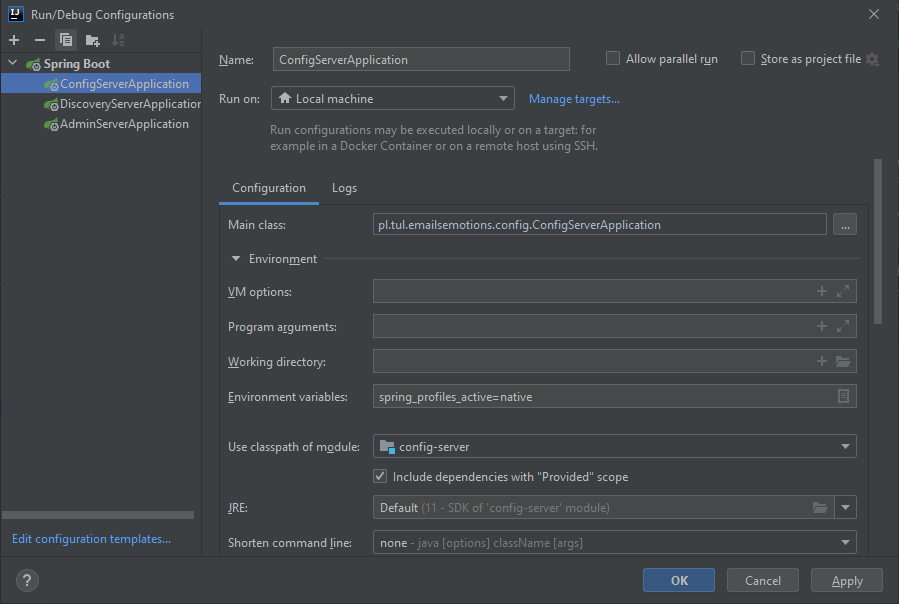

# Config Server Setup
To properly use this backend you must have proper configuration files.

It can be obtained in two ways.
1. Through git
2. Through some friends ;)

The git url for repo is: `https://github.com/EmailsEmotions/EmailsEmotionsConfiguration`

You have to make adjustments in `config-server/src/main/resources/bootstrap.yml`

Change: `native.searchLocations` for path to local git repo or try to setup github configuration.
```spring:
  cloud:
    config:
      server:
        git:
          uri: https://github.com/EmailsEmotions/EmailsEmotionsConfiguration.git
        # Use the File System Backend to avoid git pulling. Enable "native" profile in the Config Server.
        native:
          searchLocations: file:///D:\Development\Mikrousługi\EmailsEmotionsConfiguration
```

Moreover you have to make change how IDE launches config-server.
The change is to add enviromental variable for `native` profile. The variable is `spring_profiles_active=native`


