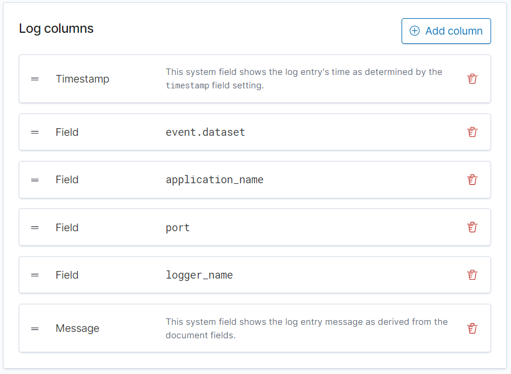

# ELK stack
The ELK stack could run by configuring ELK on your machine or running `elk-docker-compose.yaml`
```shell
$ docker-compose -f elk-docker-compose.yaml up
```
## Elasticsearch
Elasticsearch configuration is in `elk-docker-compose.yaml` file.
Elastic for now uses docker volumes instead of proper folder (subject to discuss)

## Kibana
Kibana is set on default 5601 port.
To get Kibana working with app you have to setup [Index patterns](https://www.elastic.co/guide/en/kibana/7.12/index-patterns.html)
.
## Index patterns
An index pattern can point to a specific index, for example, your log data from yesterday, or all indices that contain your log data.

Go to `/app/management/kibana/indexPatterns` and click `Create index pattern`.

Then define an index pattern for eg. `emailsemotions-api*`


Tap `Next step >`. As time field select `@timestamp`. And `Create index pattern`


Now you can check if all fields are correct (most of times they are)
## Logs
To show logs from app in Kibana go to `/app/logs/` and Settings `/app/logs/settings`

You have to setup name for source configuration and most important the Log indices.
Log indices is value that you choose for indexPattern so in our example it will be `emailsemotions*`


Next you can add some more Log columns eg. `application_name` or `logger_name`


After that you can see your logs in Stream tab `/app/logs/stream`

## Logstash / Logback
https://lankydan.dev/2019/01/09/configuring-logback-with-spring-boot
https://github.com/lankydan/logback-with-springboot-config
https://github.com/logstash/logstash-logback-encoder
https://docs.spring.io/spring-boot/docs/2.1.8.RELEASE/reference/html/boot-features-logging.html

To have logstash for diffrent index indices we can listen to some more ports in logstash.
https://www.elastic.co/guide/en/logstash/current/multiple-input-output-plugins.html
```editorconfig
# Input on tcp:5000 same as in docker-compose file
input {
    tcp {
        port => 5000
        add_field => [ "source", "emailsemotions-api-users-service" ]
        codec => json_lines
    }
    tcp {
        port => 5001
        add_field => [ "source", "emailsemotions-api-formality-service" ]
        codec => json_lines
     }
}

# Output is looking for emailsemotions api field and then goes for index
# That is configured as emailsemotions-api-%{+YYYY.MM.dd} eg. emailsemotions-api-2021.05.25
output {
    if [source] == "emailsemotions-api-users-service" {
        elasticsearch {
            hosts => [ "elasticsearch:9200"]
            index => "emailsemotions-api-users-service%{+YYYY.MM.dd}"
            ssl => false
            ssl_certificate_verification => false
        }
    }
    if [source] == "emailsemotions-api-users-service" {
        elasticsearch {
            hosts => [ "elasticsearch:9200"]
            index => "emailsemotions-api-formality-service%{+YYYY.MM.dd}"
            ssl => false
            ssl_certificate_verification => false
        }
    }
    file {
        path => "/path/to/target/file"
    }
}
```

## Java logback configuration.

One caveat is that logback requires to have all properties **BEFORE** startup.

They have to be in `application.properties` or `bootstrap.yml` 
Logback will not get config properties from `config-server`

That's why we configure `app_uuid` before.
Set property for UUID in main class
```java
@SpringBootApplication
@EnableDiscoveryClient
public class EmailServiceApplication {

    public static void main(String[] args) {
        System.setProperty("app_uuid", UUID.randomUUID().toString()); //<--- that line
        SpringApplication.run(EmailServiceApplication.class, args);
    }

}
```
That will be enough but we do some magic to add `app_uuid` to info tags in admin-server.
Create configuration class `AppProperties`
```java
import org.springframework.context.annotation.Configuration;
import javax.annotation.PostConstruct;
import java.util.UUID;

@Configuration
public class AppProperties {

    private final static UUID app_id = UUID.fromString(System.getProperty("app_uuid"));
    @PostConstruct
    private void init() {
        System.setProperty("app_uuid", app_id.toString());
    }
}
```
We read `app_uuid` from system then we are setting it up again (not sure why but this way it worked...)

Lastly we need to setup `logback-spring.xml` file. Not `logback.xml`

Paste this into `logback-spring.xml` file. 
More info on what it does on this [website](https://lankydan.dev/2019/01/09/configuring-logback-with-spring-boot)
or copy of it [here](ELK%20stack/configuring-logstash.md)
```xml
<?xml version="1.0" encoding="UTF-8"?>
<configuration>
    <include resource="org/springframework/boot/logging/logback/base.xml"/>
    <jmxConfigurator/>
    <include resource="org/springframework/boot/logging/logback/defaults.xml"/>
<!--<include resource="org/springframework/boot/logging/logback/console-appender.xml"/>-->

    <!-- Load spring properites    -->
    <springProperty scope="context" name="application_name" source="spring.application.name"/>
    <springProperty scope="context" name="logstash-server" source="spring.logstash.server"/>
    <springProperty scope="context" name="logstash-port" source="spring.logstash.port"/>
    <springProperty scope="context" name="environment" source="spring.profiles.active"/>
    <property name="LOG_PATH" value="logs"/>
    <property name="LOG_FILE" value="${LOG_PATH}/${application_name}.log"/>
    <property name="LOG_FILE_ARCHIVE" value="${LOG_PATH}/archive/${application_name}.log"/>
    <appender name="FILE" class="ch.qos.logback.core.rolling.RollingFileAppender">
        <file>${LOG_FILE}</file>
        <layout class="ch.qos.logback.classic.PatternLayout">
            <pattern>${FILE_LOG_PATTERN}</pattern>
        </layout>
        <rollingPolicy class="ch.qos.logback.core.rolling.TimeBasedRollingPolicy">
            <fileNamePattern>${LOG_FILE_ARCHIVE}-%d{yyyy-MM-dd}.%i.gz</fileNamePattern>
            <maxHistory>${LOG_FILE_MAX_HISTORY:-0}</maxHistory>
            <timeBasedFileNamingAndTriggeringPolicy class="ch.qos.logback.core.rolling.SizeAndTimeBasedFNATP">
                <maxFileSize>${LOG_FILE_MAX_SIZE:-10MB}</maxFileSize>
            </timeBasedFileNamingAndTriggeringPolicy>
        </rollingPolicy>
    </appender>

    <appender name="CONSOLE_LOGSTASH" class="ch.qos.logback.core.ConsoleAppender">
        <encoder class="net.logstash.logback.encoder.LogstashEncoder"></encoder>
    </appender>

    <appender name="LOGSTASH_TCP" class="net.logstash.logback.appender.LogstashTcpSocketAppender">
        <param name="Encoding" value="UTF-8"/>
        <remoteHost>${logstash-server}</remoteHost>
        <port>${logstash-port}</port>
        <!-- encoder is required -->
        <encoder class="net.logstash.logback.encoder.LogstashEncoder"/>
    </appender>

    <appender name="ASYNC_FILE" class="ch.qos.logback.classic.AsyncAppender">
        <appender-ref ref="FILE"/>
    </appender>

    <appender name="ASYNC_LOGSTASH_TCP" class="ch.qos.logback.classic.AsyncAppender">
        <appender-ref ref="LOGSTASH_TCP"/>
    </appender>

    <root level="INFO" additivity="false">
        <appender-ref ref="ASYNC_LOGSTASH_TCP" />
        <appender-ref ref="CONSOLE" />
<!--        <appender-ref ref="ASYNC_FILE"/>-->
    </root>
</configuration>
```
