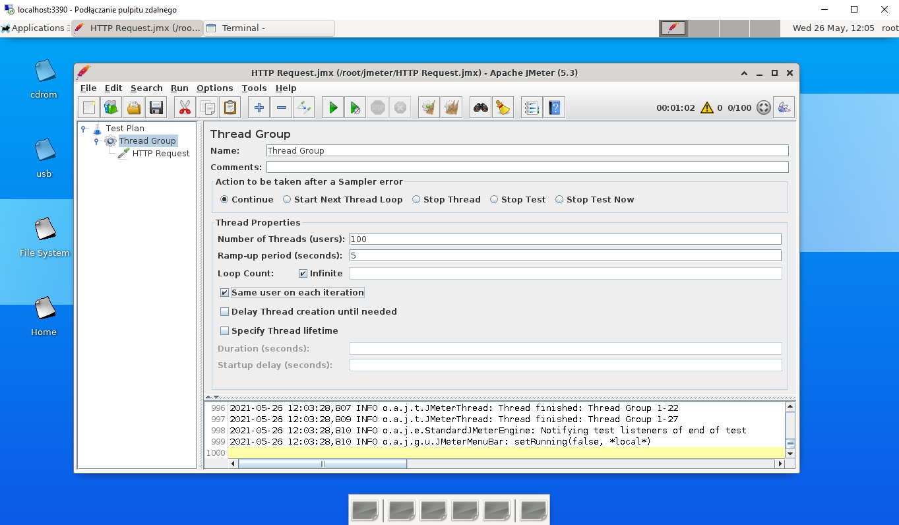

# JMeter
We use Jmeter in docker from here https://github.com/guitarrapc/docker-jmeter-gui

To spin up JMeter container
```shell
docker run -itd --rm -v ${WORK_DIR}/:/root/jmeter/ -p 5900:5900 -p 3390:3389 guitarrapc/jmeter-gui:latest
```

This one gives you GUI. You have to connect using RDP or VPC
Start->Remote Desktop Connection (Podłącz pulpit zdalny) on `localhost:3390`

Then you can start adding test. Important things are `threadgroup` and `httprequest`.

Both avaliable from `right-click -> add`



**IMPORTANT !** as Server Name or IP you have to type `host.docker.internal` and then port number of service eg. **api-gateway** on 8080
